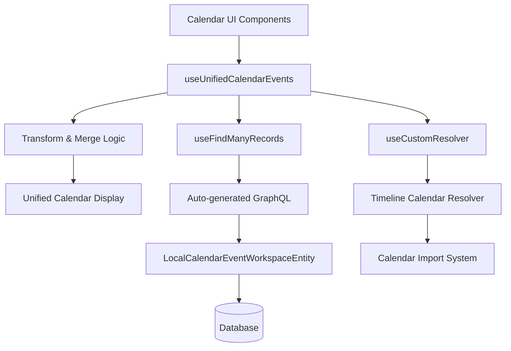

# Design Document

## Overview

The Local Calendar feature will be implemented using a separate entity approach to minimize risk to the existing calendar sync system. The design leverages Twenty's WorkspaceEntity system for automatic GraphQL generation and follows established UI patterns from Tasks and Notes modules.

## Architecture

### High-Level Architecture



### Separation Strategy

The design uses a **Separate Entity Approach** to ensure zero impact on existing calendar functionality:

- **LocalCalendarEventWorkspaceEntity**: New entity for local events
- **Unified Display Layer**: Merges local and external events for seamless UX
- **Permission Integration**: Leverages existing Twenty permission system
- **Auto-generated APIs**: Uses WorkspaceEntity for automatic GraphQL mutations

## Components and Interfaces

### Backend Components

#### 1. LocalCalendarEventWorkspaceEntity

```typescript
@WorkspaceEntity({
  standardId: 'localCalendarEvent',
  namePlural: 'localCalendarEvents',
  labelSingular: 'Local Calendar Event',
  labelPlural: 'Local Calendar Events',
})
export class LocalCalendarEventWorkspaceEntity extends BaseWorkspaceEntity {
  // Core fields
  title: string;
  description: string | null;
  startsAt: string;
  endsAt: string;
  location: string | null;
  isFullDay: boolean;
  isCanceled: boolean;
  
  // Relations
  person: Relation<PersonWorkspaceEntity> | null;
  company: Relation<CompanyWorkspaceEntity> | null;
  creator: Relation<WorkspaceMemberWorkspaceEntity> | null;
}
```

**Benefits:**
- Auto-generates GraphQL mutations (create, update, delete, find)
- Integrates with existing permission system
- Follows Twenty's standard patterns
- Zero risk to existing calendar sync

#### 2. Auto-generated GraphQL Operations

The WorkspaceEntity automatically provides:
- `createLocalCalendarEvent`
- `updateLocalCalendarEvent`
- `deleteLocalCalendarEvent`
- `findManyLocalCalendarEvents`
- `findUniqueLocalCalendarEvent`

### Frontend Components

#### 1. useUnifiedCalendarEvents Hook

Central hook that merges local and external calendar events:

```typescript
export const useUnifiedCalendarEvents = (targetableObject: ActivityTargetableObject) => {
  // Fetch external events (existing)
  const { data: externalEvents, loading: externalLoading } = useCustomResolver(...)
  
  // Fetch local events (new)
  const { records: localEvents, loading: localLoading } = useFindManyRecords({
    objectNameSingular: CoreObjectNameSingular.LocalCalendarEvent,
    filter: /* person/company filter */
  })
  
  // Transform local events to TimelineCalendarEvent format
  const transformedLocalEvents = useMemo(() => 
    localEvents.map(event => ({
      ...event,
      __typename: 'TimelineCalendarEvent',
      _isLocalEvent: true, // Internal flag
      // ... other required fields
    }))
  )
  
  // Merge and sort events
  const unifiedEvents = useMemo(() => 
    [...externalEvents, ...transformedLocalEvents]
      .sort((a, b) => new Date(b.startsAt) - new Date(a.startsAt))
  )
  
  return { data: { timelineCalendarEvents: unifiedEvents }, ... }
}
```

#### 2. LocalCalendarNewEventButton Component

Follows the pattern from RecordBoardColumnNewRecordButton:

```typescript
export const LocalCalendarNewEventButton = ({ targetableObject, size, variant }) => {
  const { objectMetadataItem } = useObjectMetadataItem({
    objectNameSingular: CoreObjectNameSingular.LocalCalendarEvent
  })
  
  const objectPermissions = useObjectPermissionsForObject(objectMetadataItem.id)
  const { createNewLocalCalendarEvent } = useCreateNewLocalCalendarEvent()
  
  if (!objectPermissions.canCreateObjectRecords) return null
  
  return (
    <Button onClick={() => createNewLocalCalendarEvent({ targetableObject })}>
      New Event
    </Button>
  )
}
```

#### 3. useCreateNewLocalCalendarEvent Hook

Follows the pattern from useCreateNewIndexRecord:

```typescript
export const useCreateNewLocalCalendarEvent = () => {
  const { createOneRecord } = useCreateOneRecord({
    objectNameSingular: CoreObjectNameSingular.LocalCalendarEvent
  })
  
  const { openRecordInCommandMenu } = useOpenRecordInCommandMenu()
  
  const createNewLocalCalendarEvent = async ({ targetableObject }) => {
    const recordId = v4()
    
    await createOneRecord({
      id: recordId,
      title: 'Untitled Event',
      startsAt: new Date().toISOString(),
      endsAt: new Date(Date.now() + 3600000).toISOString(), // +1 hour
      [targetableObject.targetObjectNameSingular + 'Id']: targetableObject.id
    })
    
    openRecordInCommandMenu({
      recordId,
      objectNameSingular: CoreObjectNameSingular.LocalCalendarEvent,
      isNewRecord: true
    })
  }
  
  return { createNewLocalCalendarEvent }
}
```

#### 4. Enhanced CalendarEventRow Component

Adds edit/delete actions for local events only:

```typescript
export const CalendarEventRow = ({ calendarEvent }) => {
  const isLocalEvent = calendarEvent._isLocalEvent === true
  
  const handleEdit = () => {
    if (isLocalEvent) {
      openRecordInCommandMenu({
        recordId: calendarEvent.id,
        objectNameSingular: CoreObjectNameSingular.LocalCalendarEvent
      })
    }
  }
  
  return (
    <StyledEventRowContainer>
      {/* Existing event display */}
      <StyledContainer onClick={isLocalEvent ? handleEdit : existingClickHandler}>
        {/* Event content */}
      </StyledContainer>
      
      {/* Actions only for local events */}
      {isLocalEvent && (
        <StyledActionsContainer>
          <LightIconButton Icon={IconEdit} onClick={handleEdit} />
          <LightIconButton Icon={IconTrash} onClick={handleDelete} />
        </StyledActionsContainer>
      )}
    </StyledEventRowContainer>
  )
}
```

## Data Models

### LocalCalendarEvent Entity Schema

```typescript
interface LocalCalendarEvent {
  id: string                    // UUID primary key
  title: string                 // Event title (required)
  description?: string          // Event description (optional)
  startsAt: string             // ISO datetime string
  endsAt: string               // ISO datetime string
  location?: string            // Event location (optional)
  isFullDay: boolean           // All-day event flag
  isCanceled: boolean          // Cancellation flag
  
  // Relations
  personId?: string            // FK to Person (optional)
  companyId?: string           // FK to Company (optional)
  creatorId?: string           // FK to WorkspaceMember (optional)
  
  // Audit fields (inherited from BaseWorkspaceEntity)
  createdAt: string
  updatedAt: string
  deletedAt?: string
}
```

### Transformation to TimelineCalendarEvent

Local events are transformed to match the existing TimelineCalendarEvent interface:

```typescript
const transformLocalEvent = (localEvent: LocalCalendarEvent): TimelineCalendarEvent => ({
  id: localEvent.id,
  title: localEvent.title,
  description: localEvent.description || '',
  location: localEvent.location || '',
  startsAt: localEvent.startsAt,
  endsAt: localEvent.endsAt,
  isFullDay: localEvent.isFullDay,
  isCanceled: localEvent.isCanceled,
  visibility: CalendarChannelVisibility.SHARE_EVERYTHING,
  conferenceSolution: '',
  conferenceLink: { primaryLinkLabel: '', primaryLinkUrl: '', secondaryLinks: null },
  participants: [],
  __typename: 'TimelineCalendarEvent',
  _isLocalEvent: true // Internal flag for UI logic
})
```

## Error Handling

### Validation Rules

1. **Title**: Required, max 255 characters
2. **Start/End Times**: Valid ISO datetime strings, end must be after start
3. **Relations**: Must reference valid Person or Company (not both)
4. **Permissions**: User must have create/update permissions

### Error Scenarios

1. **Invalid Date Range**: Display user-friendly error message
2. **Missing Required Fields**: Highlight required fields in form
3. **Permission Denied**: Hide action buttons, show read-only view
4. **Network Errors**: Show retry mechanism with loading states
5. **Concurrent Updates**: Handle optimistic locking conflicts

### Error Messages

```typescript
const ERROR_MESSAGES = {
  TITLE_REQUIRED: 'Event title is required',
  INVALID_DATE_RANGE: 'End time must be after start time',
  PERMISSION_DENIED: 'You do not have permission to perform this action',
  NETWORK_ERROR: 'Unable to save event. Please try again.',
  NOT_FOUND: 'Calendar event not found'
}
```

## Testing Strategy

### Unit Tests

1. **LocalCalendarEventWorkspaceEntity**: Field validation, relations
2. **useUnifiedCalendarEvents**: Event merging and sorting logic
3. **useCreateNewLocalCalendarEvent**: Record creation and command menu opening
4. **LocalCalendarNewEventButton**: Permission checking and rendering
5. **CalendarEventRow**: Local vs external event handling

### Integration Tests

1. **GraphQL Operations**: Auto-generated mutations and queries
2. **Permission System**: Create/update/delete permission enforcement
3. **Data Relationships**: Person/Company associations
4. **Calendar Display**: Unified event rendering

### E2E Tests

1. **Create Flow**: Navigate to Person → Calendar → Add Event → Fill Form → Save
2. **Edit Flow**: Click local event → Modify details → Save
3. **Delete Flow**: Click delete → Confirm → Verify removal
4. **Permission Flow**: Test with different user roles
5. **Mixed Display**: Verify local and external events display together

### Test Data

```typescript
const mockLocalEvent = {
  id: 'local-event-1',
  title: 'Team Meeting',
  description: 'Weekly team sync',
  startsAt: '2024-01-15T10:00:00Z',
  endsAt: '2024-01-15T11:00:00Z',
  location: 'Conference Room A',
  isFullDay: false,
  isCanceled: false,
  personId: 'person-1'
}

const mockExternalEvent = {
  id: 'external-event-1',
  title: 'Client Call',
  startsAt: '2024-01-15T14:00:00Z',
  endsAt: '2024-01-15T15:00:00Z',
  // ... other TimelineCalendarEvent fields
}
```

## Performance Considerations

### Query Optimization

1. **Indexed Fields**: Add database indexes on startsAt, personId, companyId
2. **Pagination**: Implement cursor-based pagination for large datasets
3. **Caching**: Leverage existing Apollo Client caching for local events
4. **Lazy Loading**: Load calendar events only when Calendar tab is active

### Memory Management

1. **Event Merging**: Use useMemo to prevent unnecessary re-computations
2. **Component Rendering**: Optimize CalendarEventRow with React.memo
3. **Data Transformation**: Cache transformed events to avoid repeated processing

### Database Performance

```sql
-- Recommended indexes
CREATE INDEX idx_local_calendar_event_starts_at ON local_calendar_event(starts_at);
CREATE INDEX idx_local_calendar_event_person_id ON local_calendar_event(person_id);
CREATE INDEX idx_local_calendar_event_company_id ON local_calendar_event(company_id);
CREATE INDEX idx_local_calendar_event_creator_id ON local_calendar_event(creator_id);
```

## Security Considerations

### Permission Model

1. **Object-Level Permissions**: Leverage Twenty's existing permission system
2. **Creator Ownership**: Only event creators can edit/delete their events
3. **Workspace Isolation**: Events are isolated by workspace
4. **Relation Validation**: Verify user has access to associated Person/Company

### Data Validation

1. **Input Sanitization**: Sanitize all text inputs to prevent XSS
2. **Date Validation**: Validate date ranges and formats
3. **Relation Validation**: Ensure referenced entities exist and are accessible
4. **Rate Limiting**: Apply rate limits to prevent abuse

### Audit Trail

All operations are automatically tracked through Twenty's audit system:
- Created/updated timestamps
- Creator tracking
- Soft delete support
- Change history (future enhancement)

## Migration Strategy

### Phase 1: Backend Foundation
1. Create LocalCalendarEventWorkspaceEntity
2. Update CoreObjectNameSingular enums
3. Verify auto-generated GraphQL operations
4. Add database indexes

### Phase 2: Frontend Integration
1. Implement useUnifiedCalendarEvents hook
2. Create LocalCalendarNewEventButton component
3. Update Calendar component with create button
4. Add edit/delete actions to CalendarEventRow

### Phase 3: Testing & Polish
1. Comprehensive test coverage
2. Performance optimization
3. Error handling improvements
4. Documentation updates

### Rollback Plan

If issues arise, the feature can be safely rolled back:
1. Remove LocalCalendarNewEventButton from Calendar component
2. Revert Calendar component to use original hook
3. Hide LocalCalendarEvent entity (soft disable)
4. Database cleanup can be performed later if needed

The separate entity approach ensures zero impact on existing functionality during rollback.