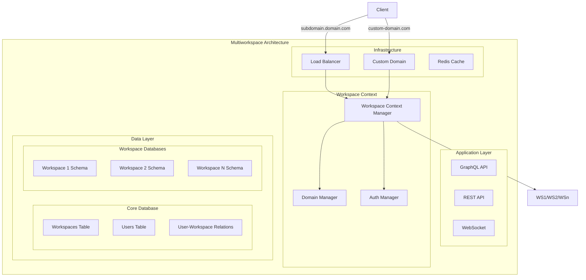
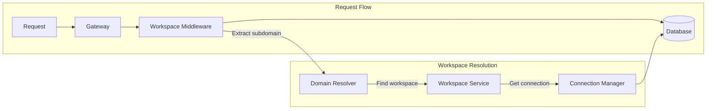
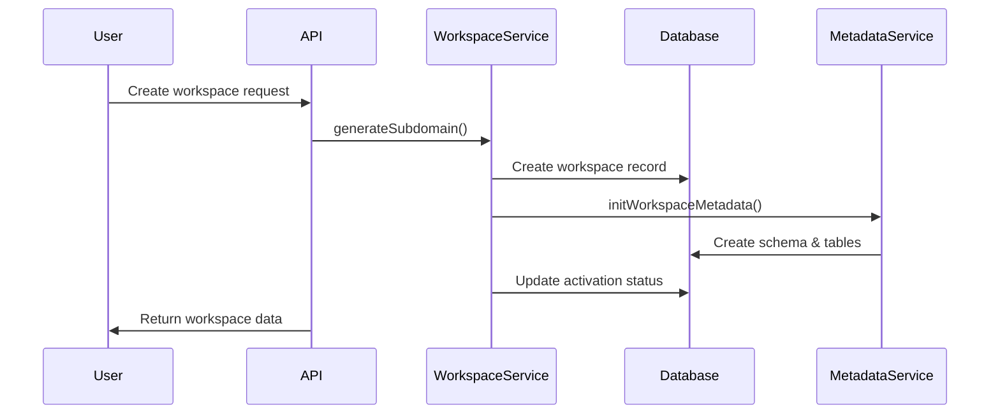

# Báo cáo Tổng hợp Kiến trúc Multiworkspace trong hệ thống Twenty

## 1. Executive Summary

Hệ thống Twenty CRM được thiết kế với kiến trúc multiworkspace (đa không gian làm việc) cho phép phục vụ nhiều tổ chức khác nhau trên cùng một cơ sở hạ tầng. Kiến trúc này đảm bảo sự cách ly hoàn toàn về dữ liệu giữa các workspace, đồng thời cung cấp khả năng mở rộng và quản lý hiệu quả.

### Điểm nổi bật:
- **Cách ly dữ liệu hoàn toàn**: Mỗi workspace có database schema riêng biệt
- **Multi-tenancy architecture**: Hỗ trợ nhiều khách hàng trên cùng infrastructure
- **Custom domain support**: Cho phép sử dụng domain riêng cho từng workspace
- **Scalable design**: Kiến trúc có thể mở rộng theo chiều ngang

## 2. System Architecture

### 2.1 Tổng quan kiến trúc



### 2.2 Core Components

#### 2.2.1 Workspace Entity
```typescript
@Entity({ name: 'workspace', schema: 'core' })
export class Workspace {
  @PrimaryGeneratedColumn('uuid')
  id: string;

  @Column({ unique: true })
  subdomain: string;

  @Column({ type: 'varchar', unique: true, nullable: true })
  customDomain: string | null;

  @Column({ default: '' })
  databaseUrl: string;

  @Column({ default: '' })
  databaseSchema: string;

  @Column({
    type: 'enum',
    enum: WorkspaceActivationStatus,
    default: WorkspaceActivationStatus.INACTIVE,
  })
  activationStatus: WorkspaceActivationStatus;
}
```

#### 2.2.2 Domain Manager Service
```typescript
@Injectable()
export class DomainManagerService {
  getWorkspaceUrls(workspace: Workspace) {
    return {
      customUrl: isCustomDomainEnabled && customDomain 
        ? this.getCustomWorkspaceUrl(customDomain)
        : undefined,
      subdomainUrl: this.getTwentyWorkspaceUrl(subdomain),
    };
  }

  getWorkspaceByOriginOrDefaultWorkspace(origin: string) {
    const { subdomain, customDomain } = this.getSubdomainAndCustomDomainFromUrl(origin);
    const where = isDefined(customDomain) ? { customDomain } : { subdomain };
    return this.workspaceRepository.findOne({ where });
  }
}
```

## 3. Database Design

### 3.1 Schema Architecture

#### 3.1.1 Core Schema (core.workspaces)
```sql
CREATE TABLE core.workspaces (
    id UUID PRIMARY KEY DEFAULT gen_random_uuid(),
    display_name VARCHAR(255),
    subdomain VARCHAR(255) UNIQUE NOT NULL,
    custom_domain VARCHAR(255) UNIQUE,
    database_url VARCHAR(500),
    database_schema VARCHAR(255),
    activation_status workspace_activation_status DEFAULT 'INACTIVE',
    metadata_version INTEGER DEFAULT 1,
    created_at TIMESTAMP WITH TIME ZONE DEFAULT NOW(),
    updated_at TIMESTAMP WITH TIME ZONE DEFAULT NOW(),
    deleted_at TIMESTAMP WITH TIME ZONE
);
```

#### 3.1.2 Workspace Isolation Strategy
- **Physical isolation**: Mỗi workspace có schema riêng trong PostgreSQL
- **Connection pooling**: Sử dụng connection pool riêng cho mỗi workspace
- **Migration management**: Migrations được chạy độc lập cho từng workspace

### 3.2 Data Flow Architecture



## 4. API Layer

### 4.1 GraphQL Implementation

#### 4.1.1 Workspace Context
```typescript
export class WorkspaceGraphQLContext {
  workspaceId: string;
  userWorkspaceId?: string;
  userId?: string;
  apiKey?: string;
}

@Injectable()
export class WorkspaceGraphqlContextFactory {
  async create(req: Request): Promise<WorkspaceGraphQLContext> {
    const workspace = await this.resolveWorkspaceFromRequest(req);
    const user = await this.resolveUserFromRequest(req);
    
    return {
      workspaceId: workspace.id,
      userWorkspaceId: user?.userWorkspaceId,
      userId: user?.userId,
      apiKey: this.extractApiKey(req),
    };
  }
}
```

#### 4.1.2 Workspace Resolver
```typescript
@Resolver(() => Workspace)
export class WorkspaceResolver {
  @Query(() => Workspace)
  @UseGuards(WorkspaceAuthGuard)
  async currentWorkspace(@AuthWorkspace() { id }: Workspace) {
    return this.workspaceService.findById(id);
  }

  @Mutation(() => Workspace)
  @UseGuards(UserAuthGuard, WorkspaceAuthGuard)
  async activateWorkspace(
    @Args('data') data: ActivateWorkspaceInput,
    @AuthUser() user: User,
    @AuthWorkspace() workspace: Workspace,
  ) {
    return this.workspaceService.activateWorkspace(user, workspace, data);
  }
}
```

### 4.2 Authentication & Authorization

#### 4.2.1 Multi-tenant Auth Flow
```typescript
@Injectable()
export class WorkspaceAuthGuard implements CanActivate {
  async canActivate(context: ExecutionContext): Promise<boolean> {
    const request = context.switchToHttp().getRequest();
    const workspace = await this.resolveWorkspace(request);
    
    if (!workspace) {
      throw new NotFoundException('Workspace not found');
    }
    
    request.workspace = workspace;
    return true;
  }
}
```

## 5. Frontend Implementation

### 5.1 React Components Architecture

#### 5.1.1 Workspace Context Provider
```typescript
export const WorkspaceContext = createContext<WorkspaceContextValue>({
  workspace: null,
  workspaceUrls: null,
  loading: true,
});

export const WorkspaceProvider: React.FC = ({ children }) => {
  const { data: workspace, loading } = useGetCurrentWorkspaceQuery();
  
  const workspaceUrls = useMemo(() => {
    if (!workspace) return null;
    return workspace.workspaceUrls;
  }, [workspace]);

  return (
    <WorkspaceContext.Provider value={{ workspace, workspaceUrls, loading }}>
      {children}
    </WorkspaceContext.Provider>
  );
};
```

#### 5.1.2 Domain-based Routing
```typescript
const useWorkspaceFromDomain = () => {
  const location = useLocation();
  const { data: workspaceData } = useGetPublicWorkspaceDataByDomainQuery({
    variables: { origin: window.location.origin }
  });

  return {
    workspace: workspaceData?.getPublicWorkspaceDataByDomain,
    isLoading: loading,
  };
};
```

### 5.2 State Management

#### 5.2.1 Recoil Atoms for Workspace
```typescript
export const currentWorkspaceState = atom<Workspace | null>({
  key: 'currentWorkspaceState',
  default: null,
});

export const workspaceUrlsState = selector({
  key: 'workspaceUrlsState',
  get: ({ get }) => {
    const workspace = get(currentWorkspaceState);
    return workspace?.workspaceUrls;
  },
});
```

## 6. Security & Authorization

### 6.1 Tenant Isolation

#### 6.1.1 Data Isolation Levels
- **Database-level isolation**: Mỗi workspace có schema riêng
- **Row-level security**: Policies trong PostgreSQL
- **Application-level isolation**: Middleware kiểm tra workspace context

#### 6.1.2 Security Implementation
```typescript
@Injectable()
export class WorkspaceSecurityService {
  async validateWorkspaceAccess(
    userId: string,
    workspaceId: string,
  ): Promise<boolean> {
    const userWorkspace = await this.userWorkspaceRepository.findOne({
      where: { userId, workspaceId },
    });
    
    return !!userWorkspace;
  }
}
```

### 6.2 Custom Domain Security

#### 6.2.1 SSL/TLS Configuration
- **Automatic SSL**: Let's Encrypt integration
- **Certificate management**: Auto-renewal và validation
- **Security headers**: CSP, HSTS, X-Frame-Options

## 7. Workflow & Business Logic

### 7.1 Workspace Lifecycle

#### 7.1.1 Creation Flow


#### 7.1.2 Activation Process
```typescript
async activateWorkspace(
  user: User,
  workspace: Workspace,
  data: ActivateWorkspaceInput,
) {
  // 1. Validate workspace status
  if (workspace.activationStatus !== 'PENDING_CREATION') {
    throw new Error('Workspace is not pending creation');
  }

  // 2. Initialize metadata
  await this.workspaceManagerService.init({
    workspaceId: workspace.id,
    userId: user.id,
  });

  // 3. Create workspace member
  await this.userWorkspaceService.createWorkspaceMember(workspace.id, user);

  // 4. Update activation status
  await this.workspaceRepository.update(workspace.id, {
    displayName: data.displayName,
    activationStatus: 'ACTIVE',
  });
}
```

### 7.2 Custom Domain Management

#### 7.2.1 Domain Registration Flow
```typescript
private async setCustomDomain(workspace: Workspace, customDomain: string) {
  // 1. Validate billing entitlement
  await this.isCustomDomainEnabled(workspace.id);

  // 2. Check domain availability
  const existing = await this.workspaceRepository.findOne({
    where: { customDomain },
  });

  // 3. Register with DNS provider
  await this.customDomainService.registerCustomDomain(customDomain);

  // 4. Update workspace record
  await this.workspaceRepository.save({
    ...workspace,
    customDomain,
  });
}
```

## 8. Technical Specifications

### 8.1 Database Configuration

#### 8.1.1 Connection Management
```typescript
export class WorkspaceConnectionManager {
  private connectionPools = new Map<string, Connection>();

  async getConnection(workspaceId: string): Promise<Connection> {
    if (this.connectionPools.has(workspaceId)) {
      return this.connectionPools.get(workspaceId)!;
    }

    const workspace = await this.workspaceService.findById(workspaceId);
    const connection = await this.createConnection(workspace);
    
    this.connectionPools.set(workspaceId, connection);
    return connection;
  }
}
```

#### 8.1.2 Schema Migration
```typescript
export class WorkspaceMigrationService {
  async migrateWorkspace(workspaceId: string) {
    const workspace = await this.workspaceService.findById(workspaceId);
    
    await this.migrationRunner.run({
      schema: workspace.databaseSchema,
      migrations: this.getMigrationsForVersion(workspace.metadataVersion),
    });
  }
}
```

### 8.2 Performance Optimization

#### 8.2.1 Caching Strategy
- **Workspace metadata cache**: Redis cho workspace configuration
- **Database query cache**: Query result caching
- **CDN integration**: Static asset caching

#### 8.2.2 Connection Pooling
```typescript
const workspacePoolConfig = {
  min: 2,
  max: 10,
  acquireTimeoutMillis: 30000,
  idleTimeoutMillis: 30000,
  reapIntervalMillis: 1000,
  createRetryIntervalMillis: 200,
};
```

## 9. Deployment & Scaling

### 9.1 Infrastructure Architecture

#### 9.1.1 Container Orchestration
```yaml
# docker-compose.multiworkspace.yml
version: '3.8'
services:
  api:
    image: twenty-server:latest
    environment:
      - IS_MULTIWORKSPACE_ENABLED=true
      - DEFAULT_SUBDOMAIN=app
    ports:
      - "3000:3000"
    
  postgres:
    image: postgres:15
    environment:
      - POSTGRES_MULTIPLE_DATABASES=core,workspace_1,workspace_2
    volumes:
      - postgres_data:/var/lib/postgresql/data
```

#### 9.1.2 Kubernetes Deployment
```yaml
apiVersion: apps/v1
kind: Deployment
metadata:
  name: twenty-multiworkspace
spec:
  replicas: 3
  selector:
    matchLabels:
      app: twenty-multiworkspace
  template:
    spec:
      containers:
      - name: twenty-server
        image: twenty-server:latest
        env:
        - name: IS_MULTIWORKSPACE_ENABLED
          value: "true"
        - name: DEFAULT_SUBDOMAIN
          value: "app"
```

### 9.2 Scaling Considerations

#### 9.2.1 Horizontal Scaling
- **Database sharding**: Theo workspace ID
- **Load balancing**: Round-robin hoặc geographic routing
- **Auto-scaling**: Dựa trên số lượng active workspaces

#### 9.2.2 Monitoring & Observability
```typescript
export class WorkspaceMetricsService {
  async collectWorkspaceMetrics(workspaceId: string) {
    return {
      activeUsers: await this.getActiveUserCount(workspaceId),
      databaseSize: await this.getDatabaseSize(workspaceId),
      apiCalls: await this.getApiCallCount(workspaceId),
      customDomains: await this.getCustomDomainCount(workspaceId),
    };
  }
}
```

## 10. Future Considerations

### 10.1 Advanced Features

#### 10.1.1 Workspace Templates
- **Pre-configured setups**: Templates cho different industries
- **Feature packages**: Bundled features theo nhu cầu
- **Migration tools**: Chuyển đổi giữa các templates

#### 10.1.2 Advanced Customization
- **White-label solutions**: Full branding customization
- **Plugin architecture**: Third-party integrations
- **API marketplace**: Public APIs cho developers

### 10.2 Scalability Improvements

#### 10.2.1 Database Optimization
- **Read replicas**: Cho reporting và analytics
- **Connection pooling optimization**: PgBouncer integration
- **Query optimization**: Indexing strategies

#### 10.2.2 Geographic Distribution
- **Multi-region deployment**: Giảm latency
- **Data residency**: Compliance với regulations
- **CDN optimization**: Global content delivery

### 10.3 Security Enhancements

#### 10.3.1 Advanced Security Features
- **Zero-trust architecture**: Enhanced security model
- **Advanced threat detection**: AI-powered security
- **Compliance certifications**: SOC 2, ISO 27001

#### 10.3.2 Data Governance
- **Data lifecycle management**: Automated retention policies
- **Audit trails**: Comprehensive logging
- **Backup & recovery**: Cross-region backup strategies

## Kết luận

Kiến trúc multiworkspace của Twenty được thiết kế với sự cân nhắc kỹ lưỡng về scalability, security và maintainability. Với cách ly dữ liệu hoàn toàn, custom domain support và flexible deployment options, hệ thống có thể phục vụ từ small businesses đến enterprise customers với yêu cầu cao về security và customization.

Các tính năng như workspace templates, advanced analytics và geographic distribution sẽ tiếp tục được phát triển để đáp ứng nhu cầu ngày càng tăng của thị trường SaaS multi-tenant.